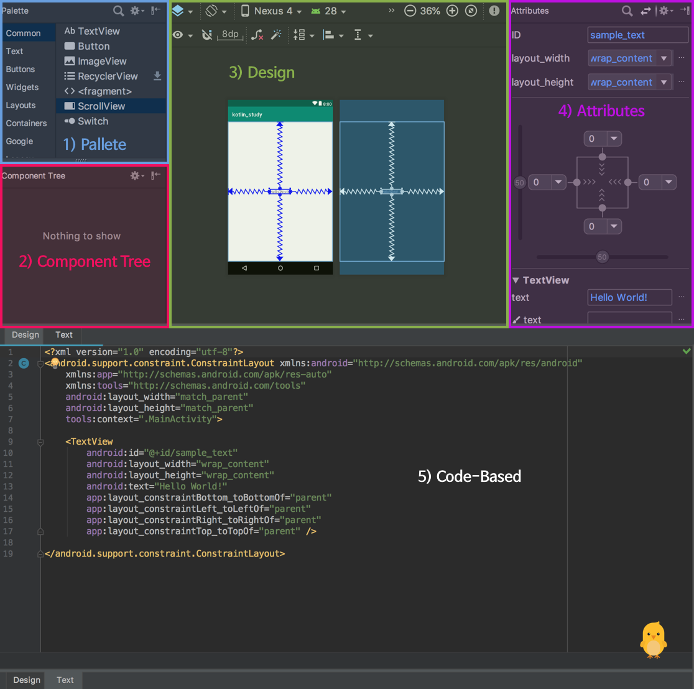

> 정아리의 코틀린 공부 공간입니다.


*2018.11.03*

Mash-Up 안드로이드 스터디 4회차 - **Layout Handling과 DTO 개념**


## Layout Handling



> 다음과 같은 키워드로 정리할 수 있습니다.

1. Pallet - **Adding**
2. Component Tree - **Structuring**
3. Design - **Manipulating**
4. Attributes - **Characterizing**
5. Code-Based - ***ALL***

## DTO Concepts

**Differences among DAO(Data Access Object) / DTO(Data Transfer Object) / VO (Value Object)**

- DAO (Data Access Object)

  - Object for accessing data in the database
  - Used to separate **a logic to access database** from **a business logic

- DTO (Data Transfer Object)

  - JavaBeans for data exchange between **"layers"**

    > JavaBeans 는 빌더 형식의 개발도구에서 가시적으로 조작이 가능하고 또한 재사용이 가능한 Java의 소프트웨어 컴포넌트입니다.

    - Which **"layers"** ? 

    

    > **Layered Architcture Pattern (N-tier Architecture Pattern)**	
    >
    > : The *separation of concerns* among components !
    >
    > 1. ***Presentation Layer***
    >
    >    Handling all user interface and browser communication logic
    >
    >    *- MVC, MVP, MVVM*
    >
    > 2. ***Business Layer***
    >
    >    Executing specific business rules associated with the request
    >
    > 3. ***Persistence Layer***
    >
    >    Saving and retrieving items that the business layer users
    >
    > 4. ***Database Layer***

  ```java
  public class Member() {
    private String name;
    private String email;
  
    public void setName(String name) {
      this.name = name;
    }
  
    public String getName() {
      return name;
    }
  
    public void setEmail(String email) {
      this.email = email;
    }
  
    public String getEmail() {
      return email;
    }
  }
  ```

  ```kotlin
  data class Member(var name: String, val email: String)
  ```


- VO (Value Object) - **Read ONLY**

    ```kotlin
    data class Member(val name: String, val email: String)
    ```


### References

[Software Architecture Patterns by Mark Richards](https://www.safaribooksonline.com/library/view/software-architecture-patterns/9781491971437/)

[Persistence Layer](http://wiki.c2.com/?PersistenceLayer)
